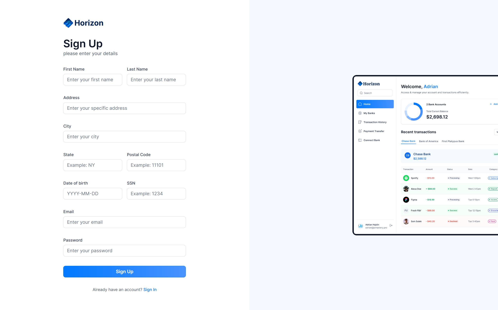

# Horizon 💳

Horizon is a modern banking service application built with **Next.js**, **Prisma**, and **Plaid**, designed to offer users a seamless digital banking experience. This project demonstrates full-stack capabilities, secure financial data integration, and a clean, responsive UI.

---

## 📱 Features

- Secure user authentication  
- Bank account linking via Plaid  
- Real-time balance and transaction fetching  
- Visual dashboard for financial insights  
- Transaction history and categorization  
- Modern and responsive design  

---

## 🛠️ Technologies Used

- [Next.js](https://nextjs.org/)  
- [Prisma](https://www.prisma.io/)  
- [Plaid](https://plaid.com/)  
- [Tailwind CSS](https://tailwindcss.com/)  
- [PostgreSQL](https://www.postgresql.org/)  
- [TypeScript](https://www.typescriptlang.org/)  

---

## 📸 Screenshot

---

## 💡 Purpose

Horizon was created to explore real-world banking app features, secure integrations with financial APIs like Plaid, and practice building a polished, full-featured financial dashboard.

